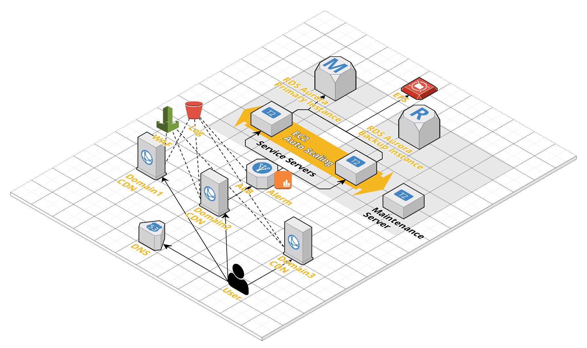

# WebApp 環境

Web アプリケーションむけ環境です。
この例は Wordpress をインストールするための構成になっています。

# アーキテクチャ

レガシーもしくは野良のウェブアプリケーションには、スレッドセーフでは無いものがあり、したがってスケールアウト構成には適しません。
この安全でない状況は主にそれらのアプリケーションがローカルファイルを操作することに起因します。
EFS にアプリケーションコードを配置し、ファイルシステムを共有することで、この問題を軽減します。
しかし、ファイルロックのやり方に起因する問題は依然発生する可能性があります。

# ディレクトリツリー

+ bin/ : ユーティリティ類
+ cloud-res/ : クラウドリソース(terraform コード)
+ server-res/ : サーバ設定ファイル類
+ docs/ : ドキュメント類

# 前提条件

+ awscli
	+ aws-mfa, Switch Role を使用する場合
+ Route53 上のドメイン

# 設定

以下のファイルに使用する awscli プロファイルの名前を書いてください。

+ ./aws-profiles.lst

主に以下の 2 ファイルを編集してください。

+ 00.terraform.tf
+ 20.locals.tf

# デプロイ
## 1. EFS のデプロイ

~~~
pushd cloud-res
terraform apply -target=aws_efs_file_system.main
# type yes to deploy
popd
~~~

## 2. user_data の更新

~~~
terraform state show aws_efs_file_system.main
~~~

dns_name の値をメモ。

以下の2つのファイルを編集。

+ 32.user-data.maintenance.full.sh
+ 32.user-data.service.full.sh

上記ファイル中の以下の行の endpoint の値に先ほどメモした dns_name の値を代入。

~~~
# !TODO! EFS endpoint must be placed.
endpoint=fs-c0000000.efs.ap-northeast-1.amazonaws.com
~~~

## 3. メンテナンスサーバ用 AMI の作成

~~~
pushd cloud-res
mv 33.ec2.maintenance-ami.tf{.off,}
terraform apply  -target=aws_instance.maintenance-ami
# type yes to deploy
# and wait decent time for deploying and installing finish
# check /var/log/user-data.log
terraform apply -target=aws_ami_from_instance.maintenance-ami
# type yes to deploy
terraform state rm aws_ami_from_instance.maintenance-ami
terraform destroy -target=aws_instance.maintenance-ami
# type yes to deploy
mv 33.ec2.maintenance-ami.tf{,.off}
popd
~~~

## 4. サービスサーバ用 AMI の作成

~~~
pushd cloud-res
mv 33.ec2.service-ami.tf{.off,}
terraform apply  -target=aws_instance.service-ami
# type yes to deploy
# and wait decent time for deploying and installing finish
# check /var/log/user-data.log
terraform apply -target=aws_ami_from_instance.service-ami
# type yes to deploy
terraform state rm aws_ami_from_instance.service-ami
terraform destroy -target=aws_instance.service-ami
# type yes to deploy
mv 33.ec2.service-ami.tf{,.off}
popd
~~~

## 5. メインリソースのデプロイ

~~~
pushd cloud-res
terraform apply
# type yes to deploy
popd
~~~
